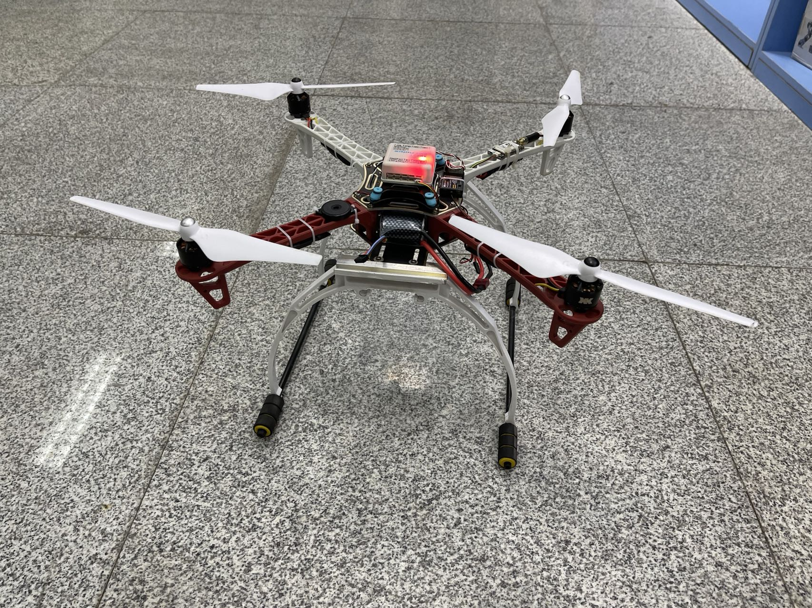
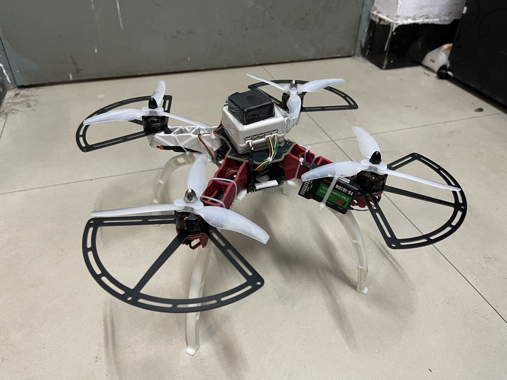
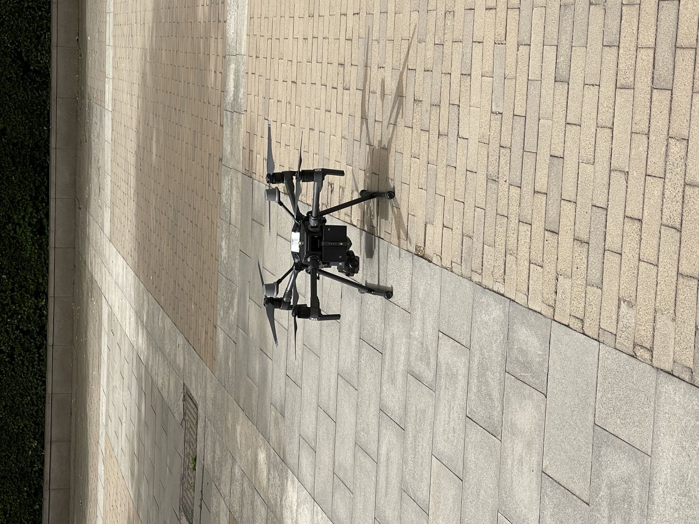

## Misc about My UAV Experience 

[back](./)

### My Gen 1 UAV

I built this 450mm framework from scratch before I was about to attend competitions. I was in the *Robot Lab of Tiangong Univerisity*, where I frequently come to experiment robots and discuss ideas with other mates. And this photo was taken in the lab.

The undercart looks shabby, it is because I "stole" its pieces from other antique robots and concatenated them together.

### My Gen 2 UAV

I built this 330mm framework to endow it higher mobility, and I tried motors with higher speed on it. Also, this prototype was facilitated with GPS, NVIDIA Jetson Nano in an attempt to achieve autonomy. This is still under experiment, I think I'll need to learn more to ultimately finish this design (hopefully one day if I have time).

### My Dream Type UAV

I was fortunate to teach a EE PhD student how to fly the DJI-M330, which is the ultimate professional UAV at that time. I was shocked by its smart autonomy and its ability to perceive its environment. Hopefully one day I will be able to learn the magic of it.

*(Details are to be completed)*

[back](./)