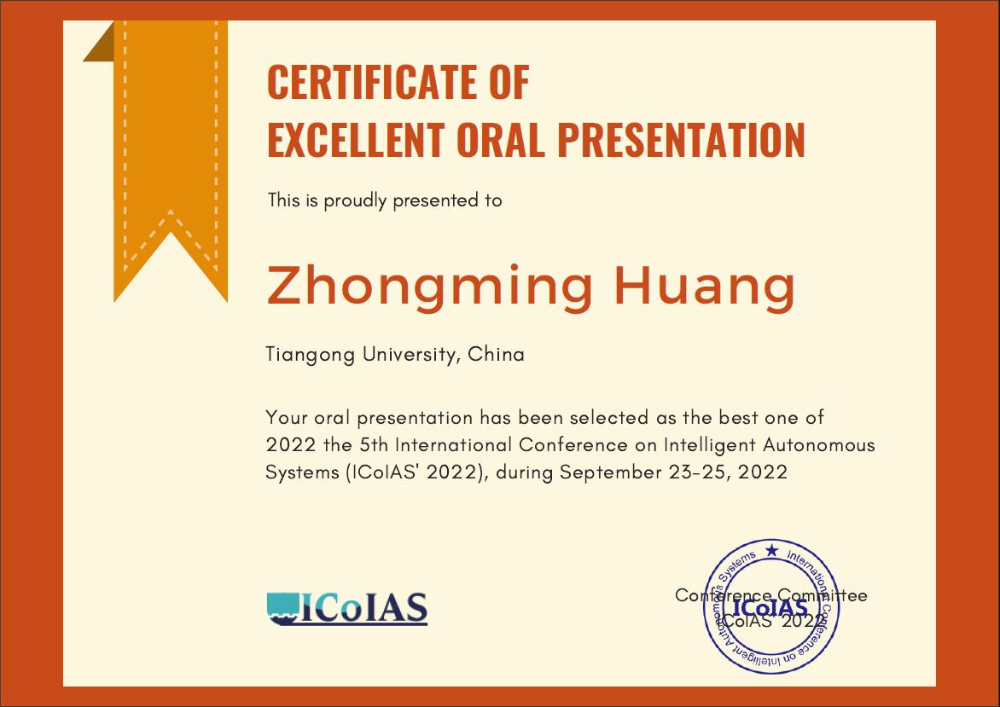

## Photos of Me Attending ICoIAS 2022

[back](./)

The 2022 5th International Conference of Intelligent Autonomous Systems was co-sponsored by IEEE and IEEE Computational Intelligence Society. I attended this conference virtually and gave a presentation on our paper *6-DoF Occluded Object Grasp Planning with De-occlusion Instance Segmentation* and have won the **Best Presentation Award**.

> This conference was shifted online due to COVID-19.

I would like to give thanks to all the staffs and attendees of ICoIAS 2022 for their endeavors and listening, as well as the insightful questions during my session.

*(Details are to be completed)*

[back](./)