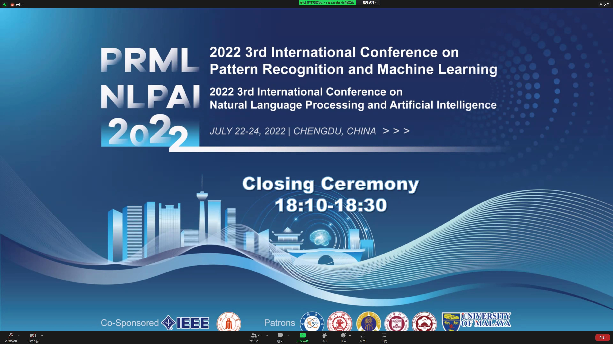
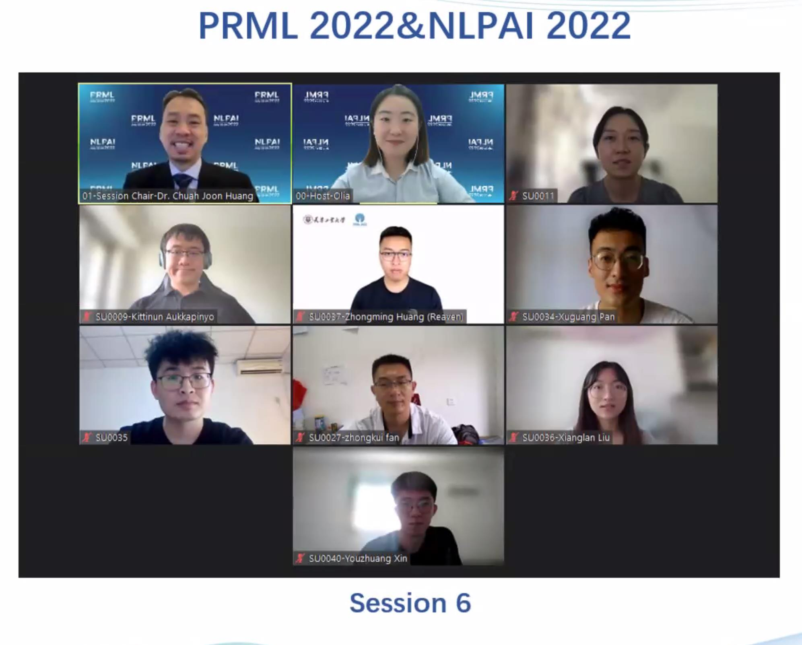
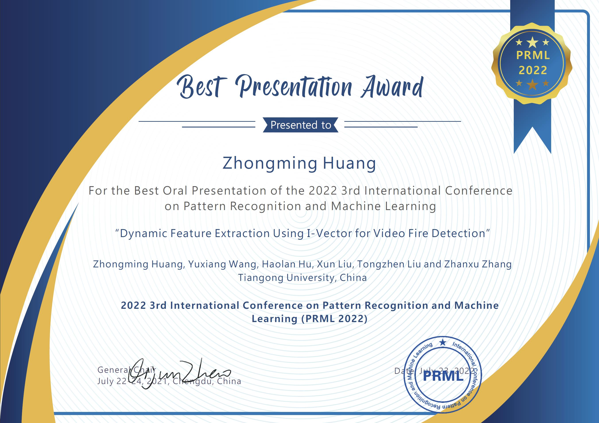

## Photos of Me Attending PRML 2022

[back](./)

The PRML 2022 was co-sponsored by IEEE and Sichuan University. I attended this conference virtually and gave a presentation on our paper *Dynamic Feature Extraction Using I-Vector for Video Fire Detection* and have won the **Best Presentation Award**.

> This conference was shifted online due to COVID-19.

I would like to give thanks to all the staffs and attendees of PRML 2022 for their endeavors and listening, as well as the insightful questions during Session 6.

*(Details are to be completed)*

[back](./)
