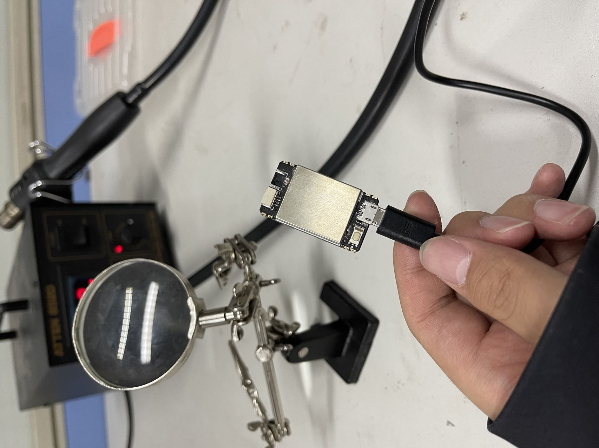
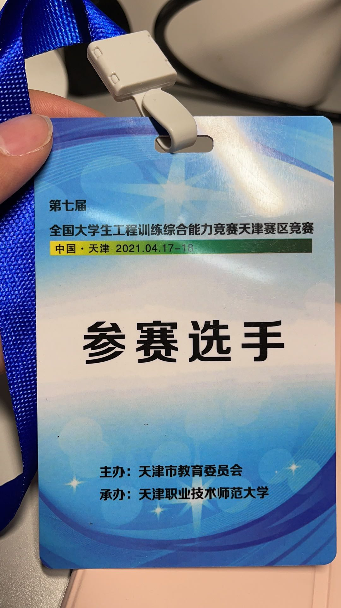
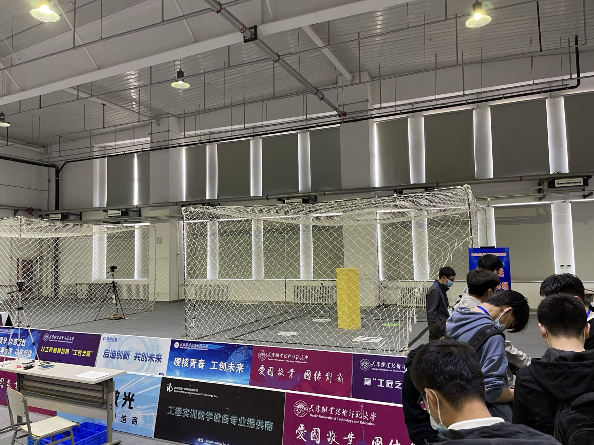
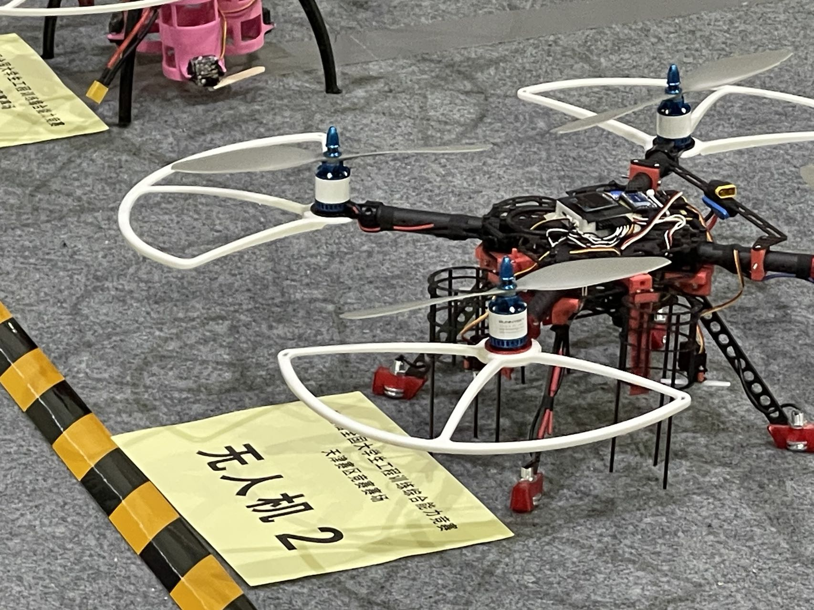
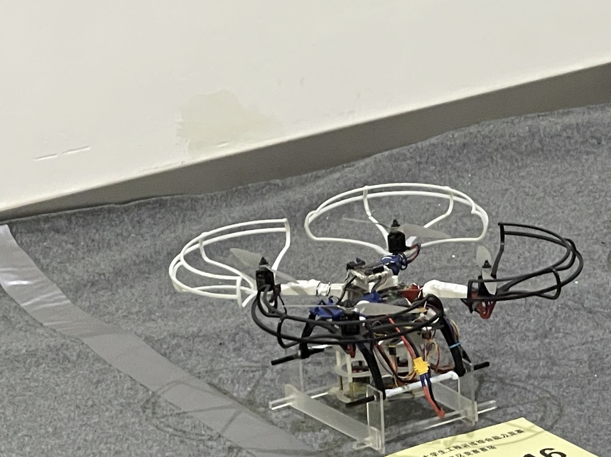
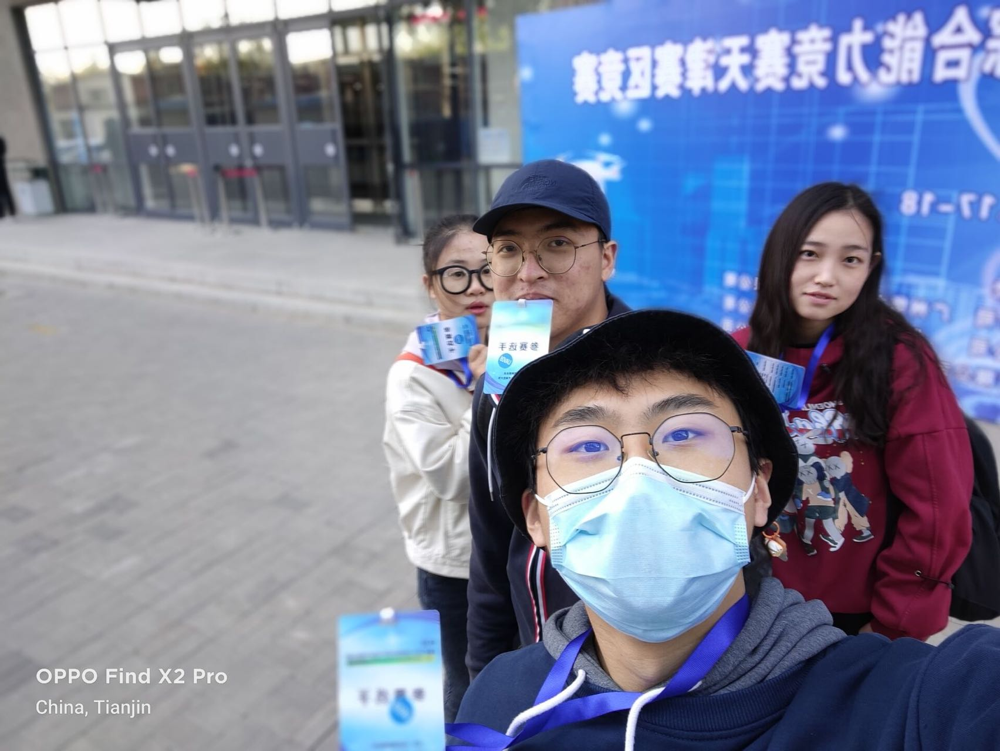

## Tianjin Provincial Project of The College Student Innovation and Entrepreneurship Plan 

[back](./)

This is the first big competition I have ever participated in. Our team worked since late 2020 till April 2021. And we finally got a provincial second prize with a little bit regret (accident happened when we were flying our UAV). But I have built bold knowledge about UAV control system and the foundamental codes a typical UAV will use, through this competition with our team.

The purpose of our UAV is to automatically takeoff and follow ground labels to finish a fixed route. During flight, the UAV is asked to avoid obstacles.

### Before Competition Day

The only light flow sensor burned just 2 days before the competition, in a regular test flight of our UAV. As you can see in the photo below, the 4 wire jocket was burned, and we were not able to connect it with the flight controller.

After all effort to repair this small device, we decided to buy another one. With the aid of supar fast logistics, we safely re-installed the second light flow sensor to the flight controller. 

> You may ask why we did not prepare more devices just in case. I think I should let you know that we were not sponsored, and we were using our own money to run the competition, so we were rather poor then :).

1 day before the competition, we fetched our competition ID Card.

### On the Competition Day

We arrived at the venue early, competitors all over this province will gather together here.

We also viewed other group's UAVs, the one most impressed me is a UAV which was embedded a Raspberry 4B and a RealSense in it. (The magic of advanced tech, and of course money, lol)

During our flight, our UAV trapped into the white protective net covering the flight area, this results in a failure of one of our two chances. We did an on-site "first-aid" to our UAV and tried our best in the next round, which turned out to be OK.

After competition, our group took a photo at the door of venue. I am at the second from left in this photo.

*(Details are to be completed)*

[back](./)
