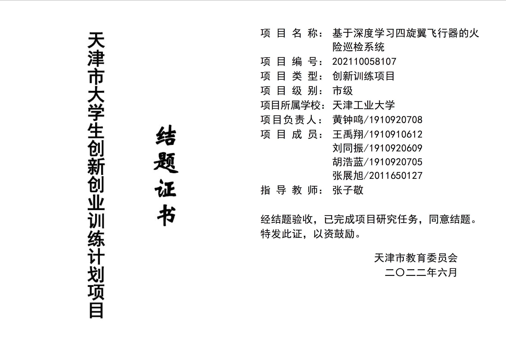

## Tianjin Provincial Project of The College Student Innovation and Entrepreneurship Plan 

[back](./)

In this project, I worked as the leader of a group of six members from EE and CS backgrounds.  We passed multiple defences to finnally get provincial funding and support. 

I learn how to construct a UAV from scratch in this project, as well as overcoming multiple malfunctions during flight. Based on the knowledge of UAV and computer vision, I led the team to propose `2 patents`, `1 Ei paper` and `1 software copyright`. And I also got familiarized to Linux during the developing process on a NVIDIA Jetson Nano where I deployed CV models.

This is the Certificate of Completion: 

I would like to give thanks to Mr.Zijing Zhang and Mr.Yukuan Sun for their insightful instructions!

*(Details are to be completed)*

[back](./)
